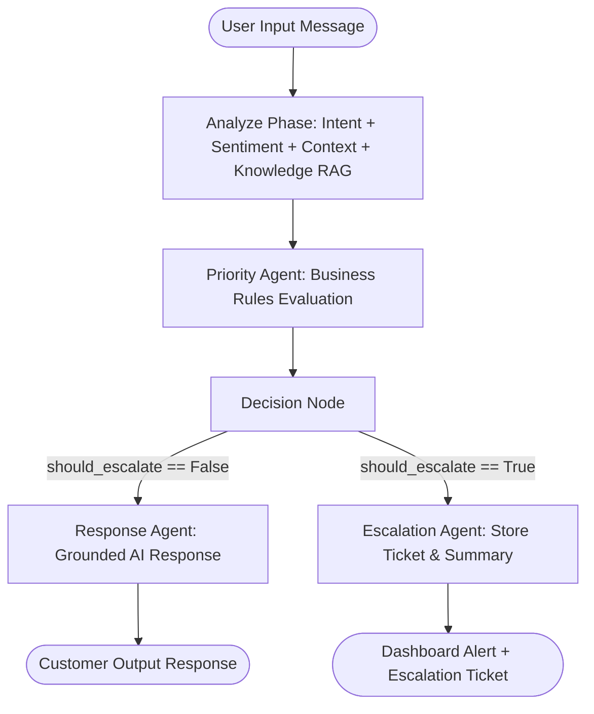

# ASSISTIQ – LangGraph Architecture & Agent Workflow Guide

This document details the internal design and data flow of the multi-agent LangGraph workflow powering AssistIQ.

---

## 🧩 Agent Breakdown & Responsibilities

| Agent Node | Responsibility | Output Schema |
|------------|----------------|---------------|
| **Orchestrator Agent** | Receives request, plans execution pipeline, passes state between nodes. | `AgentState` |
| **Intent Agent** | Classifies customer intent (`refund`, `login_problem`, `payment_issue`, etc.). | `{"intent": str, "intent_confidence": float}` |
| **Sentiment Agent** | Analyzes emotional tone (`positive`, `neutral`, `negative`, `frustrated`, `angry`). | `{"sentiment": str, "sentiment_confidence": float}` |
| **Context Agent** | Fetches customer profile (tier, history) and past tickets from PostgreSQL. | `{"customer_context": dict}` |
| **Knowledge Agent (RAG)** | Performs vector search on ChromaDB for matching FAQ/SOP/Policy chunks. | `{"retrieved_knowledge": list[dict]}` |
| **Priority Agent** | Calculates ticket priority (`LOW`, `MEDIUM`, `HIGH`, `CRITICAL`) using business rules. | `{"priority": str}` |
| **Decision Agent** | Determines whether query can be auto-resolved or requires human escalation. | `{"should_escalate": bool, "escalation_reason": str}` |
| **Response Agent** | Generates an accurate, empathetic response grounded strictly in retrieved RAG context. | `{"ai_response": str}` |
| **Escalation Agent** | Summarizes issue, formulates agent action plan, and creates ticket in DB. | `{"ticket_id": str, "ai_response": str, "escalation_summary": dict}` |
| **Feedback Agent** | Persists customer ratings (1-5 stars / thumbs up) for learning analytics. | `{"status": str}` |

---

## 🔄 Execution Graph Flow

---

## 🛡️ Business Rules Engine Logic

1. **Base Intent Priority Mapping**:
   - `payment_issue`, `cancellation`, `refund` → `HIGH`
   - `login_problem`, `technical_problem`, `delivery_issue`, `order_problem`, `account_issue` → `MEDIUM`
   - `general_question` → `LOW`

2. **Sentiment & Priority Bump**:
   - `angry` sentiment → Priority increased by 2 levels (up to `CRITICAL`).
   - `frustrated` or `negative` sentiment → Priority increased by 1 level.
   - `enterprise` customer plan tier → Priority increased by 1 level.

3. **Mandatory Escalation Trigger Conditions**:
   - `angry` sentiment detected.
   - Calculated priority equals `CRITICAL`.
   - Intent is `payment_issue` or `cancellation` with `HIGH`/`CRITICAL` priority.
   - Zero relevant knowledge retrieved from ChromaDB vector store.
