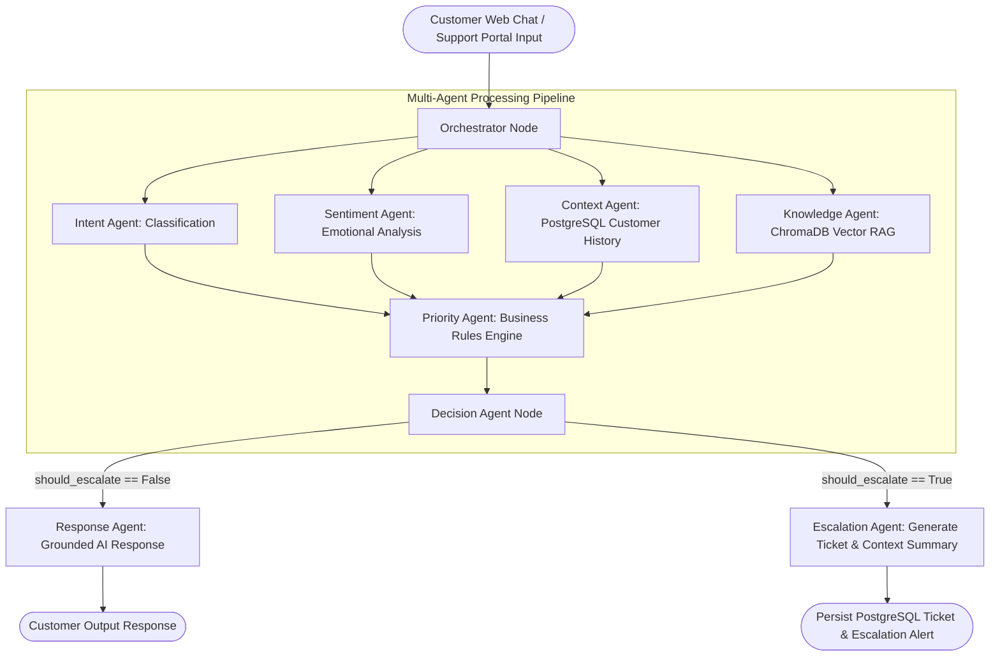

# ASSISTIQ – AI-Powered Customer Sentiment & Escalation Platform

**AssistIQ** is an enterprise-grade AI customer support platform that processes customer complaints, classifies intent and emotional sentiment, retrieves relevant customer context & knowledge base articles via Retrieval-Augmented Generation (RAG), evaluates ticket priority using a business rules engine, and automatically decides whether to resolve queries in real time or escalate them to human support agents with structured context summaries.

---

## 🌟 Architecture Overview



---

## 🚀 Key Features

- **Multi-Agent LangGraph Workflow**: Modular 8-agent workflow pipeline (Intent, Sentiment, Context, Knowledge, Priority, Decision, Response, Escalation).
- **Dual Execution Engine (`AI_MODE`)**: Supports `AI_MODE=mock` for deterministic test executions without API credits, and `AI_MODE=production` for OpenAI LLM orchestration.
- **Sentiment & Emotion Intelligence**: Classifies emotional tone (`positive`, `neutral`, `negative`, `frustrated`, `angry`) with confidence scores to auto-prioritize urgent complaints.
- **RAG Knowledge Base**: Uses ChromaDB vector search to retrieve grounded documentation from markdown knowledge bases (`account_recovery.md`, `payment_troubleshooting.md`, `refund_policy.md`, `order_tracking.md`, `subscription_cancellation.md`, `security_guidelines.md`, `general_support.md`).
- **Smart Escalation & Business Rules**: Automatically elevates high-risk billing disputes, security alerts, and angry customer complaints to human agents.
- **Human Support Dashboard**: Real-time agent interface to inspect AI context summaries, intent/sentiment metadata, recommended agent actions, and send direct replies.
- **Support Portal & Web Chat**: Intercom/ChatGPT style Web Chat with left sidebar conversation history, suggested prompt chips, typing indicators, auto-scroll, retry handler, and in-page ticket creation alerts.
- **Database Architecture**: SQLAlchemy models for Customers, Tickets, Messages, Conversations, Intent/Sentiment Analysis, Escalations, Knowledge Documents, and Feedback.

---

## 🛠️ Technology Stack

- **Frontend**: React 19, JavaScript, React Router v7, Axios, React Icons, Vanilla CSS Design System, Vite
- **Backend**: Python 3.11/3.14, FastAPI, Uvicorn, Pydantic v2
- **AI Framework**: LangGraph, LangChain, OpenAI API
- **Databases**: PostgreSQL (with automatic local SQLite fallback: `sqlite:///./assistiq.db`), ChromaDB Vector Store
- **Embeddings**: Sentence Transformers / ChromaDB HNSW Cosine Vector Indexing
- **Testing**: Pytest, FastAPI TestClient

---

## 📁 Repository Structure

```
AssistIQ/
├── backend/
│   ├── app/
│   │   ├── main.py                  # FastAPI entry point & router registration
│   │   ├── config/settings.py       # Centralized settings & AI_MODE config
│   │   ├── database/                # SQLAlchemy database connection & seed initializer
│   │   │   ├── connection.py
│   │   │   └── init_db.py
│   │   ├── models/                  # Customer, Ticket, Message, Conversation, Analysis, Escalation, Knowledge, Feedback models
│   │   ├── schemas/                 # Pydantic validation schemas
│   │   ├── routes/                  # Health, Chat, Tickets, Customers, Conversations, Knowledge, Feedback routers
│   │   ├── agents/                  # LangGraph agents & State definition
│   │   │   ├── state.py
│   │   │   ├── intent_agent.py
│   │   │   ├── sentiment_agent.py
│   │   │   ├── context_agent.py
│   │   │   ├── knowledge_agent.py
│   │   │   ├── priority_agent.py
│   │   │   ├── decision_agent.py
│   │   │   ├── response_agent.py
│   │   │   ├── escalation_agent.py
│   │   │   └── orchestrator.py      # LangGraph execution workflow builder
│   │   ├── services/                # LLM service, RAG service, Business Rules engine
│   │   └── middleware/              # Request logging middleware
│   ├── knowledge_base/              # Markdown knowledge base docs (faqs/, sops/, policies/)
│   ├── scripts/ingest_knowledge.py  # Knowledge ingestion script
│   ├── tests/                       # Complete Pytest test suite
│   ├── .env.example
│   └── requirements.txt
│
└── frontend/
    ├── src/
    │   ├── pages/                   # Home, WebChat, WebPortal, About, Dashboard
    │   ├── components/              # Navbar & layout widgets
    │   ├── services/api.js          # Centralized Axios API client
    │   └── styles/                  # Clean SaaS stylesheets
    ├── index.html
    └── package.json
```

---

## ⚡ Quickstart Guide

### 1. Prerequisites
- Python 3.10+
- Node.js 18+
- (Optional) PostgreSQL database instance

### 2. Backend Setup
```bash
cd backend

# Create virtual environment
python3 -m venv venv
source venv/bin/activate

# Install dependencies
pip install -r requirements.txt

# Configure environment variables
cp .env.example .env
# Set AI_MODE=mock for local dev or AI_MODE=production with OPENAI_API_KEY

# Ingest knowledge documents into ChromaDB
PYTHONPATH=. python3 scripts/ingest_knowledge.py

# Start FastAPI server
uvicorn app.main:app --reload --port 8000
```
Backend API will be running at `http://localhost:8000` (Swagger docs at `http://localhost:8000/docs`).

### 3. Frontend Setup
```bash
cd frontend

# Install dependencies
npm install

# Build / Run Vite dev server
npm run dev
```
Frontend web application will be accessible at `http://localhost:5173`.

---

## 🧪 Running Automated Tests

Run the backend test suite covering API routers, agent nodes, business rules engine, and verified customer scenarios:

```bash
cd backend
PYTHONPATH=. venv/bin/pytest tests/ -v
```

---

## 📊 API Endpoints Reference

| Method | Endpoint | Description |
|--------|----------|-------------|
| `GET` | `/` | Service root and status |
| `GET` | `/api/health` | API health check |
| `POST` | `/api/chat` | Main AI chat endpoint (executes multi-agent graph) |
| `POST` | `/api/tickets` | Submit a ticket via Support Portal |
| `GET` | `/api/tickets` | List support tickets (supports `status`, `priority`, `escalated` filters) |
| `GET` | `/api/tickets/{ticket_id}` | Get ticket details & message thread |
| `PATCH` | `/api/tickets/{ticket_id}` | Update ticket status, priority, or internal agent notes |
| `POST` | `/api/tickets/{ticket_id}/messages` | Add agent/customer message reply |
| `GET` | `/api/customers/{customer_id}/history` | Fetch customer history & tickets |
| `GET` | `/api/conversations/{conversation_id}` | Retrieve conversation session history |
| `GET` | `/api/knowledge` | List knowledge documents |
| `POST` | `/api/knowledge` | Create knowledge document |
| `POST` | `/api/knowledge/upload` | Upload markdown document file |
| `POST` | `/api/feedback` | Submit customer rating feedback |

---

## 🎯 Real Customer Complaint Scenarios Tested

1. **Duplicate Charge ("I was charged twice for the same order")**  
   → Intent: `duplicate_payment`, Sentiment: `frustrated`, Priority: `HIGH`.  
   → Decision: Escalate.  
   → AI: *"I understand how concerning it is to see the same charge twice. I've escalated this to our billing support team so they can verify both transactions. Your ticket ID is AI-XXXX."*

2. **Forgot Password ("I forgot my password")**  
   → Intent: `password_reset`, Priority: `LOW`.  
   → Decision: Auto-resolve.  
   → AI: *"No problem! You can reset your password using the 'Forgot Password' link on our sign-in page..."*

3. **Angry Customer ("This is ridiculous! I've been waiting three days for my refund!")**  
   → Intent: `refund_request`, Sentiment: `angry`, Priority: `CRITICAL`.  
   → Decision: Escalate.  
   → AI: *"I understand your frustration, especially after waiting three days. I've escalated your issue to our support team..."*

4. **Security Compromise ("Someone accessed my account without authorization!")**  
   → Intent: `security_issue`, Priority: `CRITICAL`.  
   → Decision: Immediate Mandatory Escalation.
