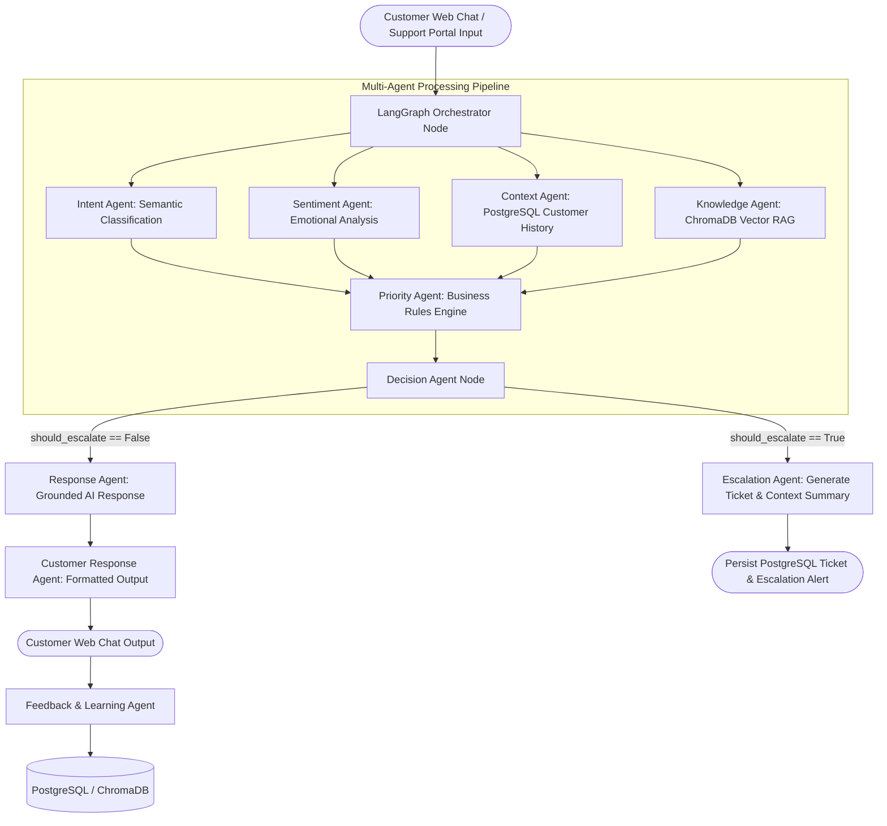

# ASSISTIQ – AI-Powered Customer Sentiment & Escalation Platform

**AssistIQ** is an enterprise-grade AI customer support platform that processes customer queries, classifies intent and emotional sentiment, retrieves relevant customer context & knowledge base articles via Retrieval-Augmented Generation (RAG), evaluates ticket priority using a business rules engine, and automatically decides whether to resolve queries in real time or escalate them to human support agents with structured context summaries.

---

## 🌟 Architecture Overview



---

## 🚀 Key Features

- **Multi-Agent LangGraph Workflow**: Modular 10-agent workflow pipeline (Intent, Sentiment, Context, Knowledge, Priority, Decision, Response, Escalation, Customer Response, Feedback).
- **ChatGPT-Style Multi-Turn Memory**: Maintains conversation memory across turns, understanding follow-up references (*"ORD12345"*, *"When will it arrive?"*, *"I already contacted support twice"*).
- **Dual Execution Engine (`AI_MODE`)**: Supports `AI_MODE=mock` for deterministic testing without API credits, and `AI_MODE=real` for OpenAI LLM orchestration.
- **Sentiment & Emotion Intelligence**: Classifies emotional tone (`Happy`, `Neutral`, `Frustrated`, `Angry`) with sentiment trajectory tracking to auto-prioritize urgent complaints.
- **RAG Knowledge Base**: Uses ChromaDB vector search to retrieve grounded documentation from markdown knowledge bases (`account_recovery.md`, `payment_troubleshooting.md`, `refund_policy.md`, `order_tracking.md`, `subscription_cancellation.md`, `security_guidelines.md`, `escalation_sop.md`).
- **Smart Escalation & Business Rules**: Automatically elevates high-risk billing disputes, security alerts, and angry customer complaints to human support agents.
- **Support Agent & Admin Dashboard**: Full operations dashboard featuring live metrics, escalated ticket queue with filterable status/priority drawer, customer CRM profiles, sentiment analytics, intent analytics, and ChromaDB vector store manager.
- **Support Portal & Web Chat**: Professional Web Chat interface with conversation history sidebar, suggested prompt chips, typing indicators, copy buttons, feedback ratings, and safe context metadata drawer.
- **Database Architecture**: SQLAlchemy models for Customers, Tickets, Messages, Conversations, Intent/Sentiment Analysis, Escalations, Knowledge Documents, and Feedback.

---

## 🛠️ Technology Stack

- **Frontend**: React 19, JavaScript, React Router v7, Axios, React Icons, Vanilla CSS Design System, Vite
- **Backend**: Python 3.11/3.14, FastAPI, Uvicorn, Pydantic v2
- **AI Framework**: LangGraph, LangChain, OpenAI API
- **Databases**: PostgreSQL (with automatic local SQLite fallback: `sqlite:///./assistiq.db`), ChromaDB Vector Store
- **Embeddings**: Sentence Transformers / ChromaDB HNSW Cosine Vector Indexing
- **Testing**: Pytest, FastAPI TestClient

---

## ⚡ Quickstart Guide

### 1. Prerequisites
- Python 3.10+
- Node.js 18+
- (Optional) PostgreSQL database instance

### 2. Backend Setup
```bash
cd backend

# Create virtual environment
python3 -m venv venv
source venv/bin/activate

# Install dependencies
pip install -r requirements.txt

# Configure environment variables
cp .env.example .env

# Ingest knowledge documents into ChromaDB
PYTHONPATH=. python3 scripts/ingest_knowledge.py

# Start FastAPI server
uvicorn app.main:app --reload --port 8000
```
Backend API will be running at `http://localhost:8000` (Swagger docs at `http://localhost:8000/docs`).

### 3. Frontend Setup
```bash
cd frontend

# Install dependencies
npm install

# Build / Run Vite dev server
npm run dev
```
Frontend web application will be accessible at `http://localhost:5173`.

---

## 🧪 Running Automated Tests

Run the backend test suite covering API routers, agent nodes, business rules engine, multi-turn memory, and verified customer scenarios:

```bash
cd backend
PYTHONPATH=. venv/bin/pytest tests/ -v
```

---

## 📊 API Endpoints Reference

| Method | Endpoint | Description |
|--------|----------|-------------|
| `GET` | `/` | Service root and status |
| `GET` | `/api/health` | API health check |
| `POST` | `/api/chat` | Main AI chat endpoint (executes multi-agent graph) |
| `GET` | `/api/chat/history/{conv_id}` | Retrieve chat session history |
| `POST` | `/api/tickets` | Submit a ticket via Support Portal |
| `GET` | `/api/tickets` | List support tickets (supports `status`, `priority`, `escalated` filters) |
| `GET` | `/api/tickets/{ticket_id}` | Get ticket details & message thread |
| `PATCH` | `/api/tickets/{ticket_id}` | Update ticket status, priority, or internal agent notes |
| `GET` | `/api/customers` | List all customer profiles |
| `GET` | `/api/customers/{customer_id}/history` | Fetch customer history & tickets |
| `GET` | `/api/conversations` | List conversation threads |
| `GET` | `/api/analytics` | Aggregate platform metrics, sentiment, intent, & CSAT |
| `GET` | `/api/knowledge` | List knowledge documents |
| `POST` | `/api/knowledge` | Create/Upload knowledge document |
| `POST` | `/api/feedback` | Submit customer rating feedback |

---

## 🎓 Internship & Viva Demonstration Outline

1. **Step 1: Open Web Chat (`http://localhost:5173/chat`)**
   - Select Customer Profile (e.g. *Jane Smith - Enterprise Tier*).
   - Type *"Hi, my order hasn't arrived."*
   - Observe Intent: `delayed_delivery`, Sentiment: `neutral`.
2. **Step 2: Multi-Turn Context Follow-Up**
   - Type *"ORD5921"*.
   - Type *"It was supposed to arrive yesterday."*
   - Notice the AI understands *"it"* refers to order `ORD5921` from conversation context.
3. **Step 3: Escalation Trigger**
   - Type *"I'm extremely frustrated. I've contacted support three times!"*
   - Sentiment changes to `angry` / `frustrated`, Priority elevates to `CRITICAL`.
   - Ticket `TKT-XXXX` is created automatically.
4. **Step 4: Support Agent Dashboard (`http://localhost:5173/dashboard`)**
   - View ticket `TKT-XXXX` in Escalated Queue.
   - Inspect customer profile, sentiment trajectory, and assign/resolve ticket.
